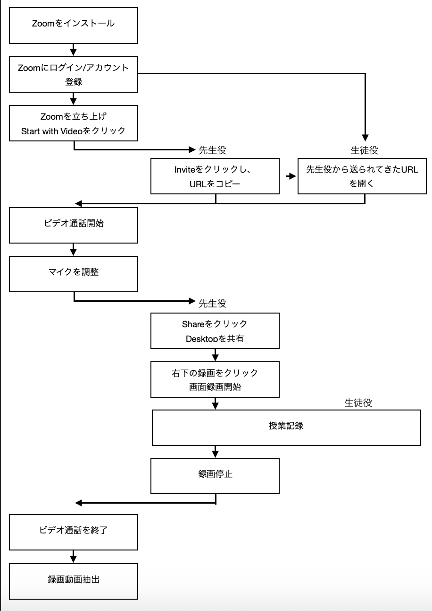

# www4nairu
## ナイル卒論本体

エンゲルバート(1962)によるコンピュータを用いた講義運営フレームワークの提示を基礎として、イリイチ(1971)によるコンピュータ技術を用い中央集権化されていない'learning web'と呼ばれる構築概念の提案は現在のオンライン教材MOOC(Massive Open Online Course)を思想を支えるとともに、近年のウェブ技術の発達によってその実装が急速に進んだ。2008年には現代的な手法を用いたMOOC方式でのオンライン講義が米国アサバスカ大学のGeorge Siemensとカナダ国家研究会議のStephen Downesらによって実践され、スタンフォード大学の教授によって創立した「Coursera」、マサチューセッツ工科大学とハーバード大学による「edX」、スタンフォード大学の元教授達が立ち上げた「UDACITY」など様々なMOOCプラットフォームが、教育の分野を大きく変えようとしている。
一方、そのコンテンツの主流はYouTubeを中心とした動画コンテンツであり、良質な教育動画コンテンツの作成には、各分野ともに工夫をし、高品質な映像コンテンツの追求が行われているが、幅広い分野の高品質な映像教育教材コンテンツが普及しているとは言えない。
そこには、高品質な映像教育教材コンテンツの作成にかかる高コストな金銭的課題と、効率の良いコンテンツ作成の手法が確立されていないことが一因と考えられる。
　そこで、本研究では、特殊な高価機材を必要とせず、一般的に普及しているノートPCをベースに、ある程度の品質を担保された映像教育教材コンテンツを作成する手法を検討・開発・実践を試みた。

